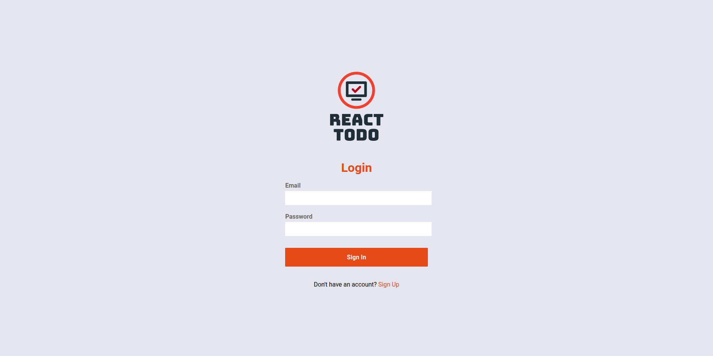
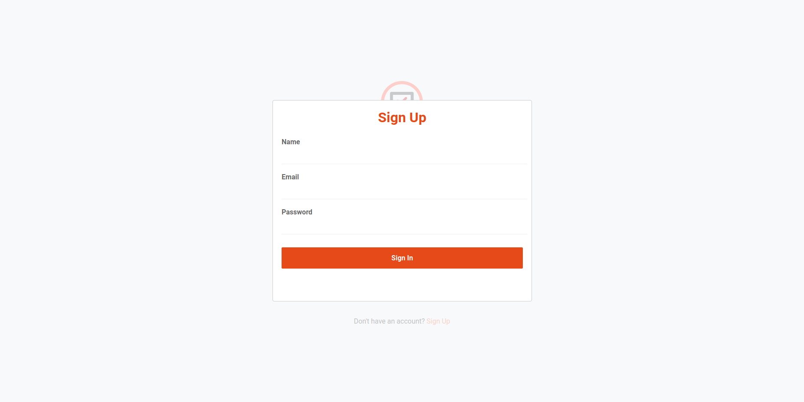
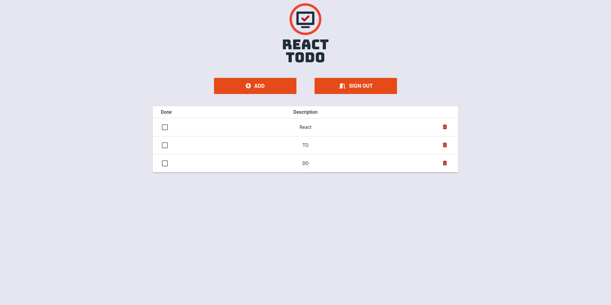

<p align="center">
  <h1 align="center"> ReactTodo </h1>
  <p align="center"> ReactJS, NodeJS, MongoDB </p>
</p>

<p align="center">
</p>


# :blue_book: React Todo Project

## Description:
* Simple todo list system
* Login and register implemented

## How to run locally
*If you want change database configuration and database connection in:

```
package/backend/config/database.json
```
package/web/src/services/api.js

*Run these commands on project folder

> `yarn install`<br>
> `yarn run backend:dev`<br>
> `yarn run web:start`<br>

## PrintScreens





